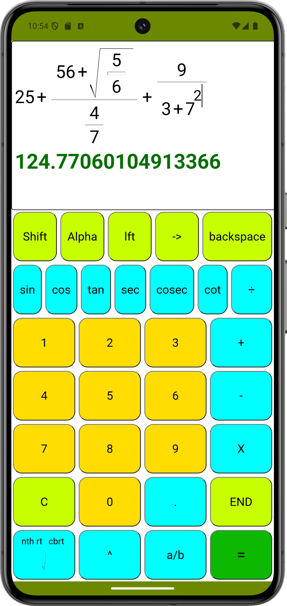

# 🧮 Scientific Calculator: The "Bookish" Engine

Most mobile calculators display math in a flat, linear string (e.g., `5/2`). This project challenges that norm by implementing a **Hybrid Android/Web Engine** that renders mathematical expressions in a natural, textbook-style layout—supporting nested fractions, radicals, and exponents in real-time.

---

## 🚀 Key Innovations

| Feature | Technical Implementation |
| :--- | :--- |
| **Natural Rendering** | Custom CSS-flexbox architecture for "Bookish" formatting (Fractions, Roots, Powers). |
| **Recursive Parsing** | A DOM-tree traversal algorithm that converts visual nodes back into evaluatable JS strings. |
| **Dynamic SVGs** | The Radical (√) symbol scales its height and stroke-width dynamically based on content geometry. |
| **Hybrid Bridge** | A high-performance Android WebView container linking Java-based mobile UI with a JS math core. |

---

## 🛠 Tech Stack

- **Languages:** JavaScript (ES6+), Java, HTML5, CSS3
- **Platform:** Android Studio (WebView API)
- **Logic:** Recursive DOM Traversal, Tree-to-String Conversion

---

## 🧠 Engineering Deep-Dive

### 1. The Tree-to-String Parser
The "heart" of this project is the `parseExpressionString()` function. Instead of using a standard text buffer, the app treats the math expression as a **Dynamic DOM Tree**. 

When "Equal" is pressed, the engine recursively walks the tree:
- **Fractions:** Recursively evaluates the `numerator` and `denominator` containers and wraps them: $$\left(\frac{\text{num}}{\text{den}}\right)$$
- **Radicals:** Maps visual root containers to `Math.pow(value, 0.5)`.
- **Exponents:** Maps superscripts to their corresponding bases using `Math.pow()`.

### 2. Geometry-Aware UI
To ensure the math looks perfect, the engine uses `getBoundingClientRect()` to calculate the height of mathematical expressions. This allows the horizontal rules (`
`) in fractions and the SVG paths in roots to grow and shrink dynamically as the user types.

---

## 📸 Preview

---

## 🚧 Future Roadmap
- [ ] **Advanced Math:** Integration of Trigonometric functions ($sin, cos, tan$).
- [ ] **Combinatorics:** Implementation of Permutations ($^nP_r$) and Combinations ($^nC_r$).
- [ ] **Dark Mode:** System-wide theme compatibility for modern Android versions.

## 👨‍💻 Developer
**Ritamanya Bhattacharjee** *Android & Full-Stack Web Developer* [Email Me](mailto:ritamanyabhattacharjee@gmail.com)
